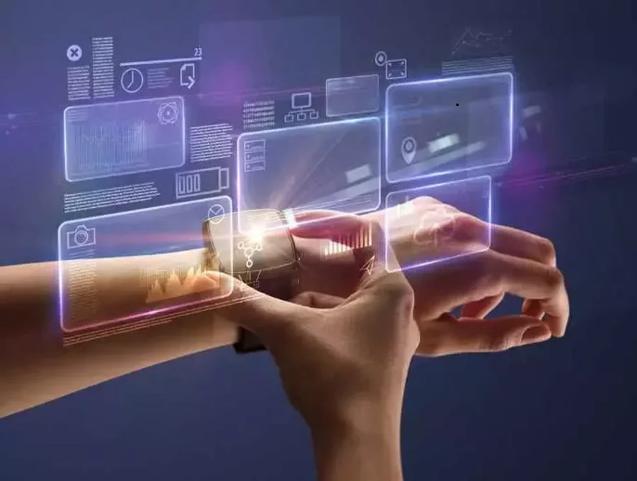

In the today’s world where the scientists are active day and night using their brain power to innovate new technologies in many fields of which health sector is part. This has both positive and negative effects on the health sector, but according to the health workers, this advancement has been mostly beneficial because it has made provision of better and standard health services to the patient easy and faster.

## **Medical Technologies.**

Technology has been applied in many medical procedures on external human body, internal human body, manufacturing drugs and even during their administrations, during surgeries and many other procedures. In the past years, most procedures where very had to perform for example the invasive surgical procedures because there was no machinery to use. In this digital era, there has been many technological advancements in the medical field where many devices have been innovated and even many procedures have been digitalized, and some of the devices include the following below.

1. **Wearable devices and smartphones**

Wearables are body accessory electronic devices that people wear today. The most example of the wearables are the smartwatches. The wearables vary in the function, and even costs but they are very important to humans today. They have reduced the workload of the physicians in hospitals as some procedures like taking the vital observations like the Heart rate, Arterial blood pressure, body temperature, physical movements, respiratory rate can be done using wearable device by the owners no matter where they might be. This has benefited a lot the old patients as they no longer need to move to the hospital just for the physicians to measure their vital signs. It has also greatly benefited the patients with chronic conditions like diabetes, asthma, heart disease since the wearable devices provide them true information about their health status in the real time frame.

Smartphones are part of the technological innovations today. These have helped so much to improve the health of the people as they help the people to download medical apps which have been used a lot by the patients to monitor their health statuses. Medical apps have enabled proper handling of and easy access to the patients' health records in the hospitals which allows constant follow up on the patients' health care. Also, these apps have provided the health workers with wealth information about different diseases and conditions, their signs and symptoms, diagnosis and treatment so, nowadays Doctors do not have to carry big textbooks during ward rounds because they now have everything on their smartphones. With smart phones, the patients can connect with other patients via social media platforms, and they discuss the different aspects like the signs and symptoms of their diseases, effectiveness of the different treatment procedures their doctors use, and undergo guidance and counselling. This has helped more the patients with non-curable diseases like the cancer patients, HIV patients and also the psychologically unstable patients because they are given advice by other patients with same diseases or even psychologists and counsellors on how to continue with life despite the fact one is to stay such condition for the rest of his or her life. Some of the online communities that bring patients together and give them support include American Cancer Society, POZ Community Forums and The Well Project for HIV patients, Uganda National Association of Cerebral Palsy and Cerebral Palsy Society of Kenya.

2. **Imaging Techniques.**

These are procedures techniques used in the hospitals to produce images of the inner parts of the human body which images are used by the physicians in diagnosis and treatment different conditions. The some of the imaging techniques include.

🔸Radiography:

During this technique, a part of the body is exposed to the beam of x-rays in order to capture the image. They are often used in the diagnosis of the tumours, fractures, and to locate foreign objects in the body like the swallowed pins. They include the Chest X-Ray, Bone X-Ray, Abdominal X-ray and the Bone Density Scan.

🔸Magnetic Resonance Imaging (MRI Scan):

An MRI Scan is used by physicians to study about the brain and the spinal cord like the brain tumours. During this technique, the patient is entered into the MRI machine where the magnetic fields are created between the body hydrogen atoms of the water molecules and the MRI Machine until a clear image is obtained. This method less affects the patients because it does not expose them to any radiations.

🔸CT Scan (Computed Tomography):

This technique provides more detailed image compared to the above-mentioned techniques. The CT scan includes muscles and blood vessels in the images. During the CT scan, the ptient is entered into the machine and is exposed to rotating X-Rays. The machine captures the X-Rays on the part of the body the doctors want to view, and these are interpreted by the computer to come up with the meaningful image which can be even turned into a 3D image. CT Scans are used to view the chest, head, abdomen, heart, spine etc.

Some the other digital devices include the Digital Diagnostic ECG System, Digital Ultrasound Prob Digital Medical Camera, Digital Stethoscope, Dental Camera, Ventilators, Anaesthesia devices.

## **Impacts of applying technology in the health field.**

Digital health has greatly improved the health sector in some of the ways as stated below.

Reduction of errors as a result of medical records.
Medical records have reduced Medical errors because the health workers  use the records to provide the right medication to each and every patient. Medical workers have used computers to store the medical records of their patients. This has enabled full follow up on the diseases that most people suffer and find ways of treating such conditions. For instance, the first case of COVID-19 was recorded in China in December 2019. Other more cases were recorded from other countries, but to confirm the different cases in different countries the medical workers referred from the signs and symptoms that the first COVID-19 infected person in China showed. Digital medical records help much in diagnosing different diseases depending on the signs showed by different patients, and help in the medical research.

Provision of high-quality health care to all parts of the world.
This is done in various ways. For example, through medical apps which have been used by the patients to discuss their conditions with their doctors, schedule appointments at different hospitals, order for medicine from different hospitals, determine the level of their exercises, feeding the children like breast feeding babies, and even the patients who might need to be given food in measurable conditions.

Through medical apps, even patients in the remote areas can receive high quality healthcare.

## **Conclusion**

Digital health is still developing. As per the World Health Global strategy, digital health is to make the high-quality health care easily accessible in high income, middle income and even low income countries between the 2020 and 2025 so that all countries provide strong health services to their citizens.

## **References**

https://www.healthline.com/health/ct-scan#procedure

https://technologymagazine.com/ai-and-machine-learning/top-10-wearable-devices-help-during-covid-19

https://www.sciencedirect.com/topics/engineering/wearable-device

https://www.healthline.com/health/ct-scan#what-is-it

https://www.medicalnewstoday.com/articles/146309

https://www.inofab.health/article/5-benefits-of-digital-health-systems

https://www.inofab.health/article/5-benefits-of-digital-health-systems

https://builtin.com/wearables

https://www.ncbi.nlm.nih.gov/books/NBK541905/#:~:text=The%20World%20Health%20Assembly%20Resolution%20on%20Digital%20Health,aims%20of%20the%20Sustainable%20Development%20Goals%20%28SDGs%29%20%284%29.

